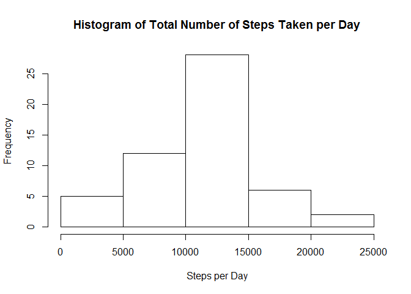
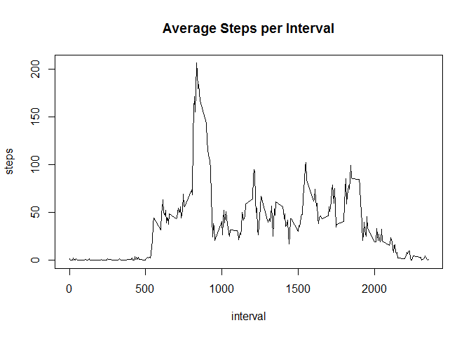
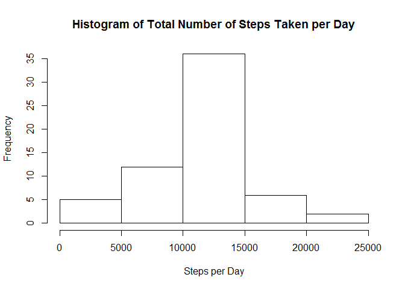

# Reproducible Research: Peer Assessment 1


## Loading and preprocessing the data

```r
###set working directory
setwd("~/R/workspace/JHU/05 Reproducible Research")

###load additional packages
library(dplyr)
```

```
## 
## Attaching package: 'dplyr'
## 
## The following objects are masked from 'package:stats':
## 
##     filter, lag
## 
## The following objects are masked from 'package:base':
## 
##     intersect, setdiff, setequal, union
```

```r
library(lattice)

###read data file
df1 <- read.csv("activity.csv", stringsAsFactors=FALSE)
```


## What is mean total number of steps taken per day?

```r
###calculate total number of steps taken per day
df2 <- aggregate(df1$steps, list(df1$date), sum)
colnames(df2) <- c("date", "steps")

###create histogram of total number of steps taken per day
hist(df2$steps, main = "Histogram of Total Number of Steps Taken per Day",
     xlab="Steps per Day")
```

 

```r
###calculate mean of the total number of steps taken per day
mean(df2$steps, na.rm=TRUE)
```

```
## [1] 10766.19
```

```r
###calculate median of the total number of steps taken per day
median(df2$steps, na.rm=TRUE)
```

```
## [1] 10765
```


## What is the average daily activity pattern?

```r
###create time series plot average number of steps/interval
df3 <- df1 %>%
    group_by(interval) %>%
    summarise_each(funs(mean(., na.rm=TRUE)), -date)
plot(df3, type="l", main="Average Steps per Interval")
```

 

```r
###Which 5-minute interval, on average across all the days in the dataset,
###contains the maximum number of steps?
df3[which(df3$steps == max(df3$steps)), ]
```

```
## Source: local data frame [1 x 2]
## 
##   interval    steps
## 1      835 206.1698
```


## Imputing missing values

```r
###calculate total number of rows with missing values
x <- is.na(df1$steps)
sum(x)
```

```
## [1] 2304
```

```r
###replace missing steps values with mean step value for that interval
    ###step 1: split original dataframe to isolate rows w/missing "steps" value
    df4a <- df1[!x,]
    df4b <- df1[x,]
    
    ###step 2: replace missing "steps" value with avg for that interval (df3)
    colnames(df4b)[1] <- "UnknownSteps"
    df4c <- left_join(df4b, df3, by="interval")
    df4d <- select(df4c, one_of(c("steps","date","interval")))
    
    ###step 3: combine dataframes
    df5 <- rbind(df4a,df4d)

###calculate total number of steps taken per day
df6 <- aggregate(df5$steps, list(df1$date), sum)
colnames(df6) <- c("date", "steps")

###create histogram of total number of steps taken per day
hist(df6$steps, main = "Histogram of Total Number of Steps Taken per Day", 
     xlab="Steps per Day")
```

 

```r
###calculate mean of the total number of steps taken per day
mean(df6$steps, na.rm=FALSE)
```

```
## [1] 10766.19
```

```r
###calculate median of the total number of steps taken per day
median(df6$steps, na.rm=FALSE)
```

```
## [1] 10766.19
```


## Are there differences in activity patterns between weekdays and weekends?

```r
###Create new factor variable in the dataset with two levels: weekday & weekend
    ###step 1: create dataframe of days of week mapped to weekday/weekend factor
    dow <- matrix(data = c("Monday","Tuesday","Wednesday","Thursday","Friday",
                       "Saturday","Sunday",
                       "weekday","weekday","weekday","weekday","weekday",
                       "weekend","weekend"), 
                  nrow=7, ncol=2, byrow=FALSE, dimnames = NULL)
    colnames(dow) <- c("day", "type")
    dow <- data.frame(dow)
    dow$day <- as.character(dow$day)
    
    ###step 2: convert dates to days of week in analysis dataframe
    y <- weekdays(as.Date(df5$date))
    df7 <- cbind(df5,y)
    colnames(df7)[4] <- "day"
    df7$day <- as.character(df7$day)
    
    ###step 3: Join analysis data frame to dow conversion dataframe
    df8 <- left_join(df7, dow, by="day")


###Make a panel plot containing a time series plot of the 5-minute interval 
###(x-axis) and the average number of steps taken, averaged across all weekday
###days or weekend days (y-axis).

df9 <- aggregate(df8$steps, list(df8$interval, df8$type), mean)
colnames(df9) <- c("interval","type","steps")
xyplot(steps~interval|type, df9,
       type = "l",
       layout = c(1,2),
       xlab="Interval",
       ylab="Number of Steps")
```

 
